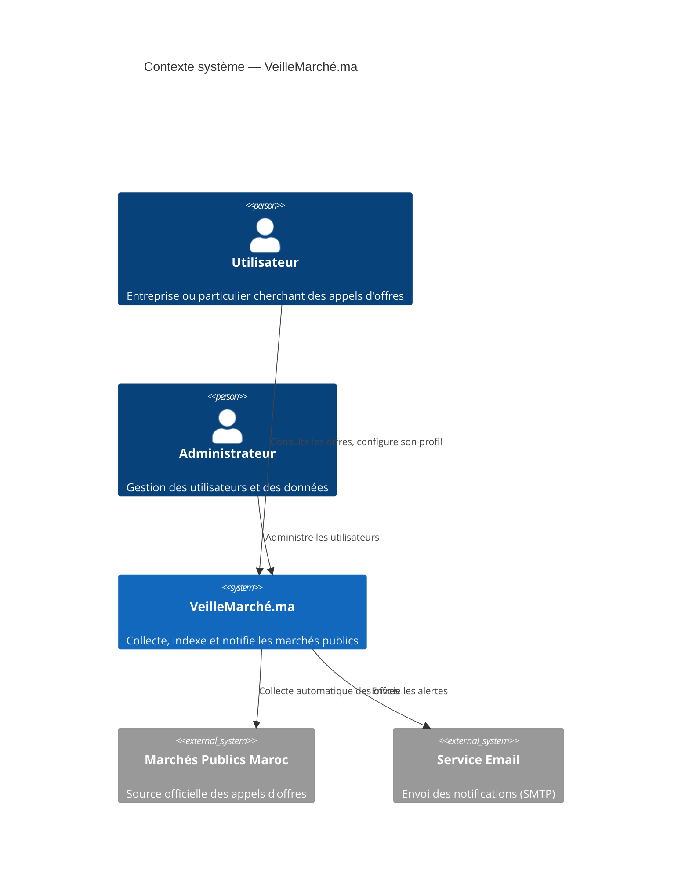
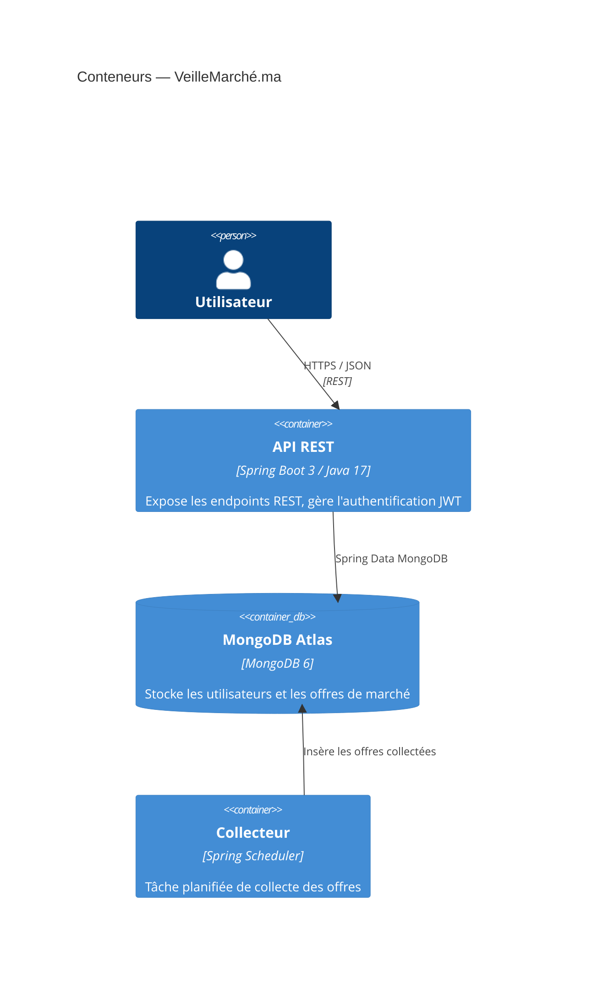

# VeilleMarché.ma — Backend API

Système d'automatisation de la veille des marchés publics au Maroc.

---

## Schéma C4

### Niveau 1 — Contexte



### Niveau 2 — Conteneurs



---

## Collections MongoDB

### Collection `utilisateurs`

Stocke les comptes utilisateurs et leurs profils de veille.

| Champ | Type | Description | Contrainte |
|---|---|---|---|
| `_id` | ObjectId | Identifiant MongoDB | PK |
| `email` | String | Email de connexion | Unique, indexé |
| `nom` | String | Nom de famille | |
| `prenom` | String | Prénom | |
| `motDePasseHash` | String | Hash bcrypt du mot de passe | |
| `role` | Enum | `USER` \| `ADMIN` | Défaut : `USER` |
| `statut` | Enum | Cycle de vie du compte | Défaut : `EN_ATTENTE_ACTIVATION` |
| `profil` | Object | Profil de veille (embedded) | Voir ci-dessous |
| `dateInscription` | DateTime | Date de création (auto) | `@CreatedDate` |

**Objet embedded `profil` :**

| Champ | Type | Description |
|---|---|---|
| `motsCles` | String[] | Mots-clés d'intérêt |
| `secteurs` | String[] | Secteurs suivis |
| `localisation` | String | Zone géographique ciblée |
| `frequenceNotification` | Enum | `IMMEDIATE` \| `DAILY` \| `WEEKLY` |

**Cycle de vie `StatutCompteEnum` :**
```
EN_ATTENTE_ACTIVATION → PROFIL_INCOMPLET → ACTIF → DESACTIVE
```

---

### Collection `offres`

Stocke les appels d'offres collectés automatiquement.

| Champ | Type | Description | Contrainte |
|---|---|---|---|
| `_id` | ObjectId | Identifiant MongoDB | PK |
| `reference` | String | Référence officielle de l'AO | Unique, indexé |
| `intitule` | String | Titre de l'appel d'offres | |
| `description` | String | Description détaillée | |
| `organisme` | String | Organisme émetteur | |
| `secteur` | String | Secteur d'activité | |
| `localisation` | String | Localisation géographique | |
| `emailContact` | String | Email de contact | |
| `urlOfficielle` | String | Lien vers l'annonce officielle | |
| `datePublication` | Date | Date de publication de l'AO | |
| `dateCloture` | Date | Date limite de soumission | |
| `dateCollecte` | DateTime | Date de collecte automatique (auto) | `@CreatedDate` |

---

## DTOs

| Record | Package | Usage |
|---|---|---|
| `LoginRequest` | `dto.auth` | Connexion utilisateur |
| `RegisterRequest` | `dto.auth` | Inscription utilisateur |
| `AuthResponse` | `dto.auth` | Réponse JWT après authentification |
| `ProfilRequest` | `dto.user` | Configuration du profil de veille |
| `UserResponse` | `dto.user` | Données publiques d'un utilisateur |
| `OffreFilter` | `dto.offre` | Filtres de recherche d'offres |
| `OffreResponse` | `dto.offre` | Données d'une offre de marché |

---

## Stack technique

| Composant | Technologie |
|---|---|
| Langage | Java 17 |
| Framework | Spring Boot 3.5 |
| Base de données | MongoDB Atlas 6 |
| Sécurité | Spring Security + JWT |
| Documentation API | OpenAPI 3 / Swagger UI |
| Build | Maven |
| Conteneurisation | Docker / Docker Compose |

**Swagger UI :** `http://localhost:8080/swagger-ui.html`
